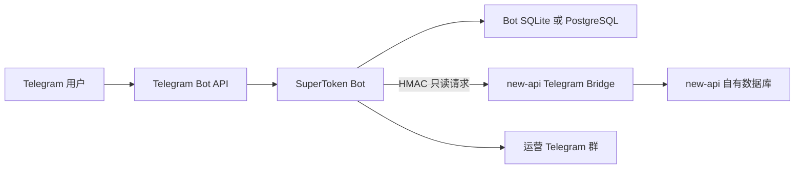
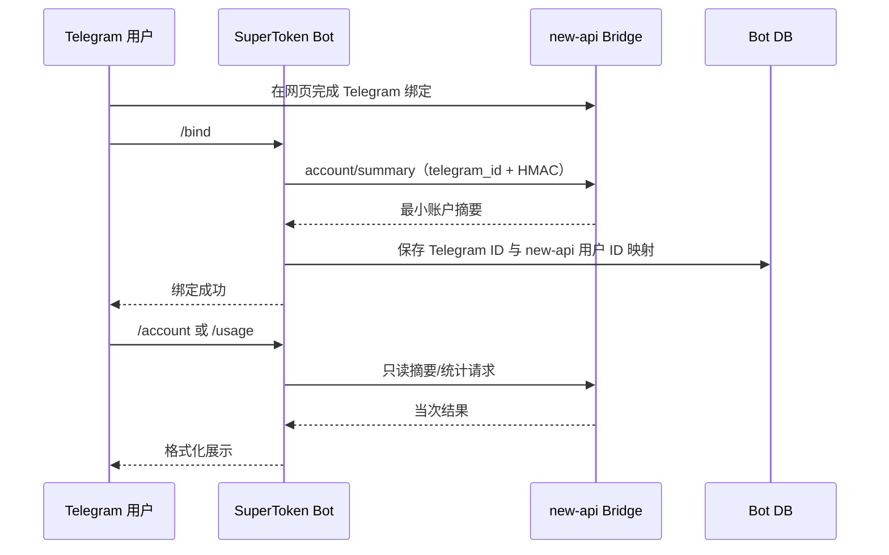

# 系统架构

## 1. 已确认实现

当前是一个 Node.js + TypeScript 模块化单体：同一进程在 Long Polling 或 Webhook 模式下处理 Telegram Update，并运行通知定时任务。没有 Redis、BullMQ、Drizzle ORM 或独立 Worker 进程；这些不应被文档写成已经存在的能力。

| 领域 | 当前选择 | 说明 |
| --- | --- | --- |
| 运行时 | Node.js 22 + TypeScript | 严格类型与 ESM |
| Telegram | grammY | 命令、回调与 Update 处理 |
| HTTP | Fastify | Webhook、`/healthz`、`/readyz` |
| 外部契约 | Zod | 校验 `new-api` 最小 DTO |
| Bot 存储 | SQLite（前期）或 PostgreSQL | Bot 自有运营数据，不与 `new-api` 共库 |
| 日志 | Pino | 不输出密钥或 `new-api` 原始响应 |
| 测试 | Vitest | 单元与 SQLite Repository 合同测试 |

SQLite 使用 Node 22 内建的 `node:sqlite`。该 Node API 目前仍有 experimental 标记，这是已确认的运行时风险；因此 SQLite 仅限单实例前期部署，并须固定 Node 22 小版本。需要多副本或独立 Worker 时切换 PostgreSQL。

## 2. 数据所有权



| 数据类别 | 权威系统 | Bot 的边界 |
| --- | --- | --- |
| 账户、额度、用量、订阅 | `new-api` | 实时读取最小摘要，不缓存或累计 |
| 请求明细、消费日志 | `new-api` | 不读取为持久化数据，不保存 |
| 订单、支付、充值、退款 | `new-api` | 不展示、不处理、不保存 |
| API Key、PAT、密码、兑换码 | `new-api` | 不接收、不保存、不转发 |
| Telegram 身份与绑定 | Bot | 保存数字 ID 与一对一绑定映射 |
| 通知偏好、去重键、Update 去重 | Bot | 保存运营所需最小状态 |
| 客服 | Telegram 会话/运营群 | Bot 仅保存回复路由映射，不保存正文副本 |
| Bot 审计 | Bot | 仅记录动作、目标和白名单运营计数 |

Node 只通过 HTTP 调用 `new-api`。Bridge 模式由 `new-api` 根据 Telegram ID 解析用户，Node 不传入可替换的用户 ID，也不直连 `new-api` 数据库。

## 3. 绑定与查询流程



账户、用量与订阅数据只在一次请求处理期间存在于内存中。通知任务也是每轮重新从 `new-api` 读取状态；数据库只保存“这个通知是否已经发过”的幂等键，不保存余额或消费数值。

## 4. Bot 数据模型

| 表 | 最小字段 | 用途 |
| --- | --- | --- |
| `telegram_users` | `telegram_user_id`、`chat_id`、`locale` | Telegram 私聊路由 |
| `account_bindings` | `telegram_user_id`、`new_api_user_id`、校验时间 | 一对一身份映射 |
| `notification_preferences` | 阈值、暂停状态 | 用户通知选择 |
| `notification_events` | 幂等键、事件类型 | 防止重复通知 |
| `support_tickets` | 工单号、用户 chat ID、运营消息 ID、状态 | 客服回复路由，不含正文 |
| `processed_updates` | Telegram `update_id` | Update 幂等 |
| `audit_logs` | 动作、目标、阈值/广播计数 | Bot 操作审计，不含外部响应 |

`processed_updates`、通知事件、关闭工单与审计日志尚未实现保留期清理，这是前期 SQLite 部署前必须补齐的运维项；不能以“数据量小”当作无限增长的理由。

## 5. 安全边界

- Bridge 只暴露账户摘要、用量和订阅三个只读接口。
- HMAC 覆盖 method、path、body hash、timestamp 与 nonce；`new-api` 持久化 nonce 防重放。
- 账号查询限定 Telegram 私聊，绑定以 Telegram 数字 ID 复核。
- 管理员功能使用数字 ID 白名单，不依赖可变更的 `@username`。
- 日志和审计不写入 Bot Token、PAT、API Key、支付参数、客服正文或完整 `new-api` 响应。
- `/support` 只做转发与回复路由；用户应被提示不要提交密钥或支付凭证。

## 6. 部署演进

前期单实例：一个 Bot 容器 + 一个挂载的 SQLite 数据卷。该模式不允许横向扩容，也不应同时运行多个通知进程。

扩容条件：需要多副本 Webhook、独立通知 Worker、跨机器存储或更强备份恢复时，将 `DATABASE_URL` 切到 PostgreSQL，并补充分布式任务锁/队列。迁移前必须演练 SQLite 备份恢复与数据导入，不能直接让两个进程共享同一个 SQLite 文件。

## 7. 关键配置

```text
NODE_ENV
BOT_MODE
PUBLIC_BASE_URL
TELEGRAM_BOT_TOKEN
TELEGRAM_WEBHOOK_SECRET
NEW_API_INTEGRATION_MODE
NEW_API_BASE_URL
NEW_API_INTEGRATION_SECRET
DATABASE_URL
BOT_ADMIN_TELEGRAM_IDS
SUPPORT_CHAT_ID
NOTIFICATION_INTERVAL_MS
NOTIFICATION_DEFAULT_LOW_QUOTA_THRESHOLD
BROADCAST_DELAY_MS
LOG_LEVEL
```

日志只能记录配置是否存在，不能输出实际密钥值。
