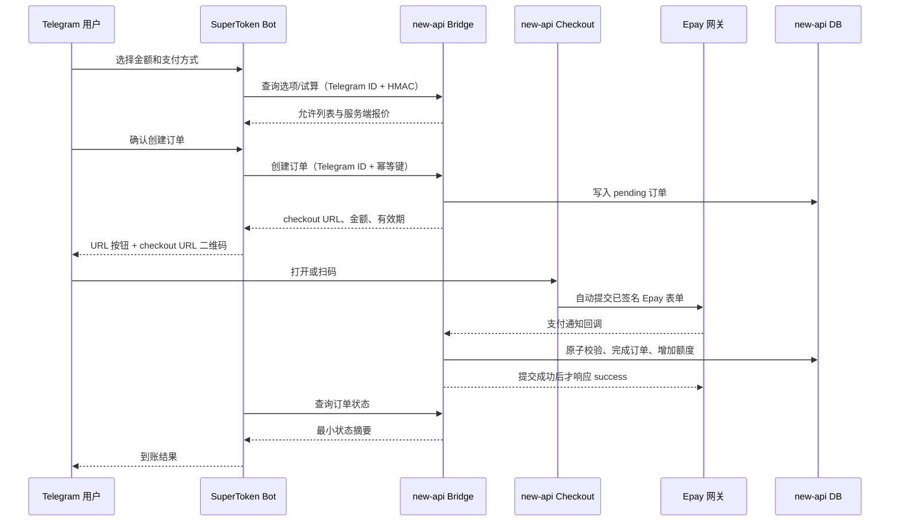

# Telegram 易支付充值：设计、开发与验收计划

## 1. 文档状态

- 状态：本地实现与 focused contract 已完成；尚未完成服务商沙箱、真实 Telegram 和生产验收。
- 范围：通过 `new-api` 已有 Epay（易支付）能力，为 Telegram Bot 增加支付宝、微信支付充值入口。
- 基线：2026-08-09 本地 `SuperTokenOverseas` 与 `/Users/bill/mygit/new-api` 的 `main` 分支。
- 风险档位：支付、额度入账和公开回调属于 `V4`。任何实现批次都必须立即运行对应的正向与反向 focused 检查，不能等到最后统一验证。

本计划改变了原先“Bot 永不提供充值入口”的产品范围，但不改变数据所有权：Bot 只发起受限的充值流程并展示 `new-api` 返回的状态，`new-api` 仍是订单、支付回调和额度账本的唯一权威系统。

新订单由 `new-api` 的 `TELEGRAM_TOPUP_ENABLED=true` 显式开启，默认关闭。关闭该开关只阻止新报价和新建单，不会撤销已创建的 checkout 或阻断 Epay 回调入账。

## 2. 已确认事实、工程判断与未知项

### 2.1 已确认事实

- `new-api` 已有 Epay 充值订单、支付表单、通知回调和额度增加代码。
- 管理后台可配置 `alipay` 和 `wxpay`；它们作为 Epay 的支付类型参数传给配置的易支付网关，不是官方支付宝/微信商户 SDK 直连。
- 网页当前通过 `uri + params` 构造 HTML POST 表单并跳转；Telegram Bot 不能直接复用这个浏览器表单动作。
- 本地 `new-api` 已新增受 HMAC、时间戳与持久化 nonce 保护的充值选项、报价、建单和状态 Bridge 接口。
- Epay 只有在支付合规声明已确认，并同时配置支付地址、商户 ID、密钥和至少一种支付方式时才会启用。
- 本地实现将 Epay 成功回调的订单锁定、金额与方式校验、状态转换和额度增加置于同一数据库事务；只有提交后才响应 `success`。MySQL/PostgreSQL 使用行锁，SQLite 由事务串行化。

### 2.2 工程判断

- TG 端可靠的二维码应编码本系统的短期 checkout URL。用户打开或扫描后，由 `new-api` 页面自动提交 Epay 表单；不依赖每家易支付服务商返回相同格式的原生二维码字段。
- 在开放 TG 充值前，必须先修复 Epay 回调的原子入账、幂等、金额核对和确认时序。否则新增入口会扩大“已付款但未到账”的风险。
- Web 和 Telegram 应共享一个订单创建服务，不能复制两套金额计算、订单号生成和回调处理逻辑。
- Bot 不应持有 Epay 商户密钥，也不应把支付表单参数、订单详情或交易哈希写入自己的 SQLite。

### 2.3 暂时无法验证

- 实际易支付服务商是否同时支持 `alipay`、`wxpay`，以及两种类型的沙箱行为。
- 回调的签名字段中是否稳定包含金额、币种和上游交易号；需根据实际服务商协议和脱敏样例确认。
- 当前部署环境是否已经完成支付合规确认、商户配置、公开 HTTPS 回调域名和退款/客诉流程。
- 服务商是否提供真正的沙箱。没有沙箱时，真实最小额支付只能由用户明确授权并亲自完成。

## 3. 产品范围

### 3.1 首期包含

- 已绑定用户在 Bot 私聊中查看当前可用充值方式和充值金额选项。
- 支持管理员在 `new-api` 中启用的 Epay `alipay`、`wxpay`。
- 用户选择金额与支付方式后看到服务端计算的实际支付金额和 checkout 有效期。
- 用户明确确认后，由 `new-api` 创建唯一待支付订单。
- Bot 返回“打开支付”URL 按钮和同一 URL 的二维码图片。
- 用户可查询最近一笔由 Telegram 发起的充值状态。
- 用户可从订单消息点击“查询状态”，实时读取 `new-api` 的到账状态。
- Bot 重启或 SQLite 丢失不影响订单查询和回调入账。

### 3.2 首期不包含

- Bot 代用户确认或执行付款。
- 官方支付宝、微信支付 SDK 直连；首期只接现有 Epay 网关。
- Bot 内退款、补单、人工加减额度、订单删除或支付配置管理。
- Bot 保存支付订单、支付参数、交易流水、二维码内容或商户凭据。
- 链上稳定币的真实入账与归集；Mock 阶段仅验证 USDT/USDC 在 BSC、Ethereum、Base、Solana 的地址展示和订单状态交互。链上监听、确认、重组和资金归集必须单独设计、测试网验收并获得上线审批。
- Telegram Stars、Telegram Payments 或银行卡资料采集。

## 4. 用户交互设计

### 4.1 主菜单

当前主菜单增加一项“充值中心”，仍只在私聊中可用：

```text
[绑定账号] [账户余额]
[用量统计] [订阅状态]
[充值中心] [最新公告]
[通知设置] [联系客服]
[帮助]     [解绑]
```

### 4.2 充值流程

1. 用户点击“充值中心”或发送 `/topup`。
2. Bot 调用 Bridge 获取当前启用方式、最小充值额、预设金额和额度显示类型。
3. 未绑定、支付未配置或合规开关关闭时，只显示明确原因，不展示不可用按钮。
4. 用户选择预设金额，或发送 `/topup <整数金额>`。首期不做需要持久会话状态的自由文本向导。
5. 用户选择 `支付宝` 或 `微信支付`。支付方式完全来自 `new-api` 返回的允许列表，Bot 不写死可用状态。
6. Bot 展示充值额度、实际支付金额、支付方式和有效期，并提供“确认创建订单”和“取消”按钮。
7. 用户确认后，Bot 使用 callback query ID 生成幂等键，请求 `new-api` 创建订单。
8. Bot 发送 checkout URL 按钮和二维码。二维码只包含公开、短期、签名的 checkout URL。
9. 用户在外部页面自行完成支付。Bot 不模拟点击、不自动付款。
10. 用户点击“查询状态”读取 `new-api` 的实时结果；本期未实现主动到账通知。

### 4.3 状态文案

| 状态 | 用户可见含义 | Bot 行为 |
| --- | --- | --- |
| `pending` | 等待支付 | 展示打开支付和刷新状态 |
| `processing` | 支付已受理，正在确认 | 仅允许刷新，不重复建单 |
| `success` | 已到账 | 展示入账额度和完成时间 |
| `failed` | 支付失败 | 提供重新创建订单入口 |
| `expired` | 订单已过期 | 不再打开原支付页，允许重新创建 |

“取消”只关闭当前交互，不退款、不撤销服务商侧已经受理的付款。订单状态必须以 `new-api` 为准。

## 5. 目标架构与数据所有权



| 数据 | 权威系统 | Bot 是否持久化 |
| --- | --- | --- |
| Epay 地址、商户 ID、密钥 | `new-api` 配置/Secret Manager | 否 |
| 报价、订单、支付方式、支付金额 | `new-api` | 否 |
| 回调原文、上游交易号、入账结果 | `new-api` | 否 |
| 用户额度和充值账本 | `new-api` | 否 |
| Telegram Update 去重、通知投递去重 | Bot DB | 是，仅保存幂等元数据 |
| Telegram 与 `new-api` 身份绑定 | 两边各自现有最小映射 | 是，不增加支付字段 |

## 6. `new-api` 目标接口

所有 Bot Bridge 请求继续使用现有 HMAC、时间戳和持久化 nonce 防重放，并由服务端根据 Telegram ID 解析已启用用户。Node 不传可替换的 `new_api_user_id`。

### 6.1 查询充值选项

```text
POST /api/integrations/telegram/v1/topup/options
```

请求只包含 `telegram_id`。响应返回：

- `enabled`
- `display_type`
- `min_topup`
- `amount_options`
- `payment_methods`：只允许返回公开名称、类型、颜色/图标提示和各自最低金额

绝不返回支付地址、商户 ID、密钥或原始 operation settings。

### 6.2 服务端试算

```text
POST /api/integrations/telegram/v1/topup/quote
```

请求包含 `telegram_id`、整数 `amount` 和允许列表中的 `payment_method`。响应返回服务端计算的 `topup_amount`、`payable_amount` 和短有效期。客户端金额不能作为最终支付金额或入账依据。

### 6.3 创建订单

```text
POST /api/integrations/telegram/v1/topup/orders
```

请求包含 `telegram_id`、`amount`、`payment_method` 和 `idempotency_key`。服务端重新计算金额并执行以下校验：

- 用户仍处于启用和绑定状态；
- 支付合规仍已确认；
- Epay 与所选支付方式仍启用；
- 金额满足服务端最小值和整数范围；最大值尚未形成可验证的全局配置合同；
- 同一幂等键只能得到同一个订单结果。

响应只返回公开订单引用、服务端最终金额、状态、checkout URL 和过期时间。Epay 表单参数不返回 Bot。

### 6.4 查询状态

```text
POST /api/integrations/telegram/v1/topup/status
```

请求包含 `telegram_id` 和公开订单引用。服务端必须同时按解析出的用户 ID 与订单引用查询，防止用户枚举或跨账号查询。响应只返回展示所需状态、充值额度、支付金额、支付方式、创建/完成时间。

### 6.5 Checkout 页面

```text
GET /api/integrations/telegram/v1/checkout/:signed_token
```

- token 绑定订单号、用途和过期时间，使用独立 checkout signing secret 签名。
- 页面只接受仍属于 `pending`、未过期且支付方式仍有效的订单。
- 服务端从订单重新构造 Epay 表单，页面加载后自动 POST 到配置的 Epay 地址。
- 页面设置严格 CSP、`Referrer-Policy: no-referrer`、`Cache-Control: no-store`，不加载第三方分析脚本。
- token 泄露最多允许打开该笔支付页，不能查询用户资料、修改金额或访问其他订单。

## 7. P0 支付安全改造

本地实现已完成以下 `new-api` 修复；服务商协议与三数据库矩阵仍待验收：

1. 将 Epay 验签、订单归属校验、支付方式校验和两位小数金额校验放在入账之前。现有 Epay 合同没有可验证、可配置的币种字段，不能在代码或文案中虚构币种保证。
2. 新增单一权威的 `CompleteEpayTopUp` 领域操作，在一个数据库事务内完成行锁、状态转换、完成时间、额度增加和必要审计。
3. 删除对进程内订单锁的正确性依赖；SQLite 使用事务串行化，MySQL/PostgreSQL 使用项目的 `lockForUpdate`。
4. 只有数据库事务提交成功后才向 Epay 返回 `success`。内部失败返回 `fail`，允许服务商按协议重试。
5. 对重复成功回调实行幂等：同一已成功订单且回调关键字段一致时返回 `success`，但绝不重复增加额度。
6. 支付网关、订单支付方式或金额不一致时拒绝入账，不能静默把订单支付方式改成回调类型。
7. 使用项目统一的安全 quota 转换函数，禁止未检查的浮点数到 `int` 强转或溢出后入账。
8. 日志只记录请求 ID、订单引用、提供商、状态和错误分类；不记录完整回调参数、签名、Epay 表单参数或密钥。

### 7.1 建议的兼容性字段

在不破坏现有 `TopUp` 读取合同的前提下，采用可回滚的加法迁移：

- `payment_amount_minor`：实际支付金额的最小货币单位整数；
- `payment_currency`：例如 `CNY`；
- `expires_at`：订单过期时间；
- `idempotency_key`：TG 创建请求幂等键，唯一索引；
- `source`：`web`、`telegram` 等受控枚举；
- `provider_trade_no`：服务商交易号，按需保存并建立唯一约束。

旧 `money` 字段先保留并双写，待兼容版本和数据核对完成后再决定迁移，不能在同一批次删除。

## 8. Bot 侧实现边界

- 在 `NewApiClient` 增加 options、quote、create order、status 四个最小 DTO；所有响应先检查 envelope，再做 Zod 校验。
- 在 grammY 菜单增加 `topup` 回调和 `/topup [amount]` 命令。
- callback data 只携带受控短值或公开订单引用，长度不超过 Telegram 限制。
- 使用成熟 QR 库把 checkout URL 生成 PNG，并通过 Telegram 发送；测试必须实际解码图片并比对原 URL。
- 不把订单写入 Bot Repository。状态查询每次实时调用 `new-api`。
- 本期不做主动到账通知；用户通过订单消息查询实时状态。未来若增加通知，只能保存投递幂等键，不保存金额和回调体。
- Bot 日志禁止输出 checkout token、完整 URL query、Bridge secret 和 Telegram Bot Token。
- `/unbind` 不影响已经支付或待回调订单；`new-api` 仍按创建时用户归属完成入账。

## 9. 分阶段开发计划

以下是单名熟悉两边代码的开发者估算，属于工程判断，不是交付承诺。服务商协议、沙箱和部署权限是主要变量。

| 阶段 | 内容 | 主要产出 | 估算 |
| --- | --- | --- | --- |
| 0. 合同冻结 | 确认服务商协议、回调字段、币种、最小/最大额、沙箱与错误响应 | 脱敏 fixture、字段表、Go/No-Go 清单 | 1-2 人日 |
| 1. Epay P0 加固 | 原子入账、幂等、金额校验、延后 success、日志脱敏 | 已完成本地 SQLite focused contract；三库验收待做 | 3-5 人日 |
| 2. 共享订单服务 | 网页/TG 共用创建与试算服务，checkout token 与页面 | 已完成本地实现 | 3-5 人日 |
| 3. Telegram Bridge | options、quote、create、status，HMAC、跨用户隔离 | 已完成本地接口与合同测试；限流待运维策略确认 | 2-4 人日 |
| 4. Bot 交互 | 键盘、确认、二维码、状态查询，保持 SQLite 无支付数据 | 已完成本地实现与二维码解码测试；主动到账通知不在本期 | 3-5 人日 |
| 5. 联调与灰度 | 假网关、服务商沙箱、观测、回滚演练、单方式灰度 | 验收证据与运行手册 | 2-4 人日 |

总量约 14-25 人日。未取得服务商协议或沙箱时，可以完成模拟环境开发，但不能宣称真实支付已验收。

## 10. 验收标准

### 10.1 功能验收

- `F1`：未绑定用户不能查看支付选项、创建订单或查询订单。
- `F2`：合规未确认或 Epay 配置不完整时，Bot 不显示可支付按钮。
- `F3`：支付宝/微信按钮只根据 `new-api` 当前允许列表出现。
- `F4`：相同 Telegram callback 的重复创建请求只产生一个订单。
- `F5`：Bot 展示的充值额度和支付金额与 `new-api` 订单完全一致；支付币种以服务商页面和其已确认协议为准。
- `F6`：URL 按钮和二维码打开同一 checkout 地址；二维码可被标准解码器读取。
- `F7`：有效支付回调后用户额度只增加一次，订单完成时间和状态正确。
- `F8`：Bot 重启、SQLite 重建或暂时离线都不影响 Epay 回调入账；恢复后仍可从 `new-api` 查询状态。
- `F9`：订单过期后 checkout 页面拒绝继续支付，Bot 可创建新订单。

### 10.2 安全与账务验收

- `S1`：无 HMAC、错误 HMAC、过期时间戳和重复 nonce 均不能调用 TG 充值 Bridge。
- `S2`：用户 A 无法创建或查询用户 B 的订单，修改公开订单引用也不能枚举订单。
- `S3`：修改 amount、payment method、checkout token 或 Epay 回调字段不能改变订单金额或入账额度。
- `S4`：无效签名、错误金额、错误支付方式、失败状态和未知订单均不入账；币种校验须等待服务商提供可验证字段后再纳入合同。
- `S5`：同一回调串行、并行或跨实例重复到达时，额度只增加一次。
- `S6`：订单状态与额度增加在一个事务中；注入额度更新失败时订单不能被错误标记为成功，Epay 也不能收到成功确认。
- `S7`：SQLite、MySQL、PostgreSQL 均通过相同入账合同。
- `S8`：仓库、日志、Bot 消息、审计记录和错误上报中搜索不到 Epay key、回调签名、Bot Token、Bridge secret 和完整 checkout token。

### 10.3 运行验收

- `O1`：新建订单失败、Epay 回调失败、幂等命中、入账成功都有结构化指标，但不含敏感负载。
- `O2`：关闭 TG 新建订单功能后，旧 checkout、回调和状态查询仍保留到所有待支付订单过期并结算完成。
- `O3`：`new-api`、Bot 或 Telegram 暂时不可用时不会丢失已支付订单；恢复后可重试通知。
- `O4`：公开 checkout 和 callback 路由有请求体限制、速率限制、HTTPS 与 no-store 安全头。

## 11. 测试计划

### 11.1 `new-api` focused contract

新增确定性测试，使用临时隔离数据库和假 Epay 客户端，不连接真实商户：

- 创建订单：最小值、最大值、非法金额、非法方式、未绑定用户、禁用用户、合规关闭、配置缺失。
- 金额计算：USD/CNY/TOKENS/CUSTOM 显示配置、折扣、用户组倍率和舍入边界。
- Checkout：有效、篡改、过期、非 pending、错误用途 token，以及生成表单不泄露到日志。
- 回调：有效成功、签名失败、金额/方式不一致、未知订单、失败状态、重复回调、并发回调。
- 故障注入：订单状态写入失败、额度更新失败、提交失败；每种都必须证明没有部分入账且响应不是 `success`。
- Bridge：HMAC 正反向、nonce 重放、时间窗、用户隔离、幂等创建、最小 DTO。
- 数据库矩阵：SQLite、MySQL、PostgreSQL 跑同一完成订单合同。

建议 focused 命令：

```text
go test ./model ./service ./controller ./middleware -run 'Epay|TopUp|TelegramIntegration' -count=1
go test ./middleware ./service ./controller ./router ./model
```

第一条在每个支付批次立即运行；第二条在稳定集成批次运行一次。新增测试必须接入 CI，不能只留本地命令。

### 11.2 Bot focused contract

- 菜单只在私聊显示充值入口。
- 未绑定、支付关闭、无可用方式和 Bridge 超时的文案。
- 预设金额、自定义整数、最小/最大值和非法输入。
- 创建订单前确认；取消不调用创建接口。
- 重复 callback 使用同一幂等键。
- 生成二维码后用解码器还原并精确比对 checkout URL。
- 状态映射、消息长度、Markdown/HTML 转义和敏感 URL 脱敏。

建议命令：

```text
npm run typecheck
npm test
npm run build
```

### 11.3 本地端到端

建立可销毁的假 Epay HTTP 服务，提供支付表单页和可签名回调：

1. 启动临时 `new-api` 数据库、`new-api`、Bot SQLite 和假 Epay。
2. 测试账号完成 Telegram 绑定。
3. 通过模拟 Telegram Update 创建订单，打开 checkout 或解码二维码。
4. 假 Epay 发送成功回调，验证订单和额度只变化一次。
5. 并发发送同一回调，验证 exact-once 入账。
6. 在回调前后分别重启 Bot，证明入账不依赖 Bot 存活。
7. 停止 `new-api` 后恢复，验证 Bot 给出可重试提示且不会重复建单。

所有数据库、凭据和用户必须是测试 fixture。禁止连接生产数据库或用真实付款冒充自动化验收。

### 11.4 服务商沙箱与人工证据

- 沙箱需覆盖支付宝、微信支付各一笔成功、一笔取消/失败、一笔重复通知。
- 核对服务商后台金额、`new-api` 订单、用户额度和 Bot 状态四方一致。
- 人工检查手机 Telegram、桌面 Telegram 和微信/支付宝跳转体验。
- 若服务商无沙箱，真实最小额支付属于外部金融行为，必须由用户另行明确授权并亲自完成；自动化不能代替这项证据。

### 11.5 验证证据

每项验收记录：命令、测试 fixture、数据库类型、相关路径、结果、Git SHA 和时间。局部单测通过不能表述为真实支付已上线；只有沙箱/明确授权的实付证据才能证明外部服务商闭环。

## 12. 发布与回滚

1. 保持 `TELEGRAM_TOPUP_ENABLED=false`，先上线 Epay P0 修复并观察现有网页充值。
2. staging 开启 TG 充值，先接假网关，再接服务商沙箱。
3. 生产先对白名单测试账号开放一种方式，建议按实际服务商稳定性选择，不预设支付宝或微信必然更可靠。
4. 验证回调成功率、订单未到账数、重复通知和平均确认时间后，再开放第二种方式和更大用户范围。
5. 回滚时只关闭“新建 TG 订单”和菜单；旧 checkout、Epay callback、状态查询与入账代码必须继续运行，直到所有 pending 订单完成或过期。
6. 数据库采用加法迁移；回滚应用不得要求删除列、删除订单或修改已完成账本。

## 13. 开发 Go/No-Go 条件

开始阶段 1 前必须确认：

- 易支付服务商协议和脱敏成功/失败回调样例；
- 支持的支付类型、币种、金额精度、回调重试语义和沙箱能力；
- `new-api` 支付合规确认与运营主体责任；
- 测试环境、三种临时数据库和公开 HTTPS callback/checkout 域名；
- 订单过期时间、最小/最大充值额、退款和人工补单责任人；
- 密钥通过部署 Secret 注入，且具备轮换方案。

缺少服务商真实合同不会阻止代码设计和假网关测试，但会阻止沙箱/生产验收。不得用“前端已有支付宝/微信按钮”推导真实商户已经可用。
